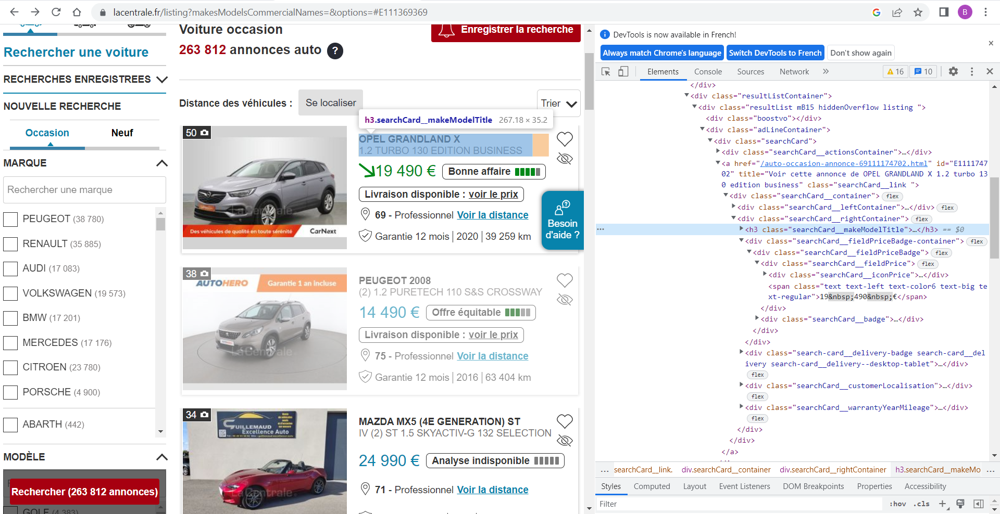

<h1 align="center"><font size="7" >Web scraping</font></h1>

# Introduction

In this simple project, I propose a classic way to gather the data from the web. I use a free web site of vehicle advertisements in France [**La centrale**](https://www.lacentrale.fr/) to gather the annonyme data of vehicles.
\
\
**Important remark**
\
When I made this project, the weeb site "La Central" didn't verify proptly if there is a robot or not. In the future the website can introduce a robot verification and the below code will not woork correctely. 
\
Actually the website ask a verification as you can see below, but the weeb scraping work very well anyway, so I think that this verification isn't efficace.


<p style="text-align:center">
    <a>
    
    </a>
</p>

# Calling the necessary libraries
**Reminder** : you can easily install a new library in Jupyter by the command **!pip install name_of_labrary**. \
Example: "!pip install bs4". for more information please please see the [link](https://pypi.org/project/bs4/) of bs4


```python
################## Importing libraries #############################
from bs4 import BeautifulSoup
from urllib.request import Request, urlopen
import warnings
import datetime
import pandas as pd
import numpy as np
```

**Initialisation**


```python
warnings.filterwarnings('ignore')
df=pd.DataFrame(columns=['page','href','model','version','price','dep','prof','warranty','year','km'])
Nb=0
```

# The loop of each page of the website

#### the main loop "for i in range (1,501)"

The below part is the main part of the project. The main loop change the page index each time, so it open the page 1 and 2 and soone. We can change manually the page number "1" in the link 'https://www.lacentrale.fr/listing?page=1' by the number 2 or other number.\
I remark manually that the maximum number of pages is 500, because of that the for loop change the index "i" from 1 to 500 (see below).
\
\
In this loop, the programme open the html file by **urlopen** and extract data from HTML by using [BeautifulSoup](https://www.crummy.com/software/BeautifulSoup/bs4/doc/).


#### the second loop "for d in divs":
We can remark manually that each page shows 15 or 16 vehicles. This loop extract the data from each vehicle in the same page. especially the link of each vehicle by the command href='https...
We can find data of each vehicle page in soup2. and the rest of code will read the needed data by using **find_all** command.
\
\
To know which data you must read and how you can click on the **Inspection** by the right mouse click in the needed area, see the screenshot below: 




```python
for i in range (1,501): ########## Looping for each weebsite pages, the weebsite show 500 pages as maximum, 16 vehicles by page #########
    try:
        ################### Opening each page
        url=r'https://www.lacentrale.fr/listing?page='+str(i)
        userAgent = "Mozilla/5.0 (Windows NT 10.0; WOW64) AppleWebKit/537.36 (KHTML, like Gecko) Chrome/46.0.2490.86 Safari/537.36"
        req = Request(url, None, {'User-Agent': userAgent})
        html = urlopen(req).read()
        soup= BeautifulSoup(html,"html.parser")
        divs = soup.find_all("div", {"class": "searchCard__rightContainer"})
    except:
        break  ############ Break if the page didn't open  ######################
    for d in divs:
        try:
            ################# gatherig the data from each page  ###################
            href='https://www.lacentrale.fr'+d.parent.parent['href']
            model=d.h3.find_all('span', {"class": "searchCard__makeModel"})[0].text
            version=d.h3.find_all('span', {"class": "searchCard__version"})[0].text
            price=d.div.div.select('div[class^="searchCard__fieldPrice"]')[0].find_all('span')[-1].text
            dep=d.select('div[class^="searchCard__customerLocalisation"]')[0].select('div[class^="searchCard__dptCont"]')[0].text
            prof=d.select('div[class^="searchCard__customerLocalisation"]')[0].select('div[class^="cbm-txt--default searchCard__customer"]')[0].text
            warranty=d.select('div[class^="searchCard__warrantyYearMileage"]')[0].select('div[class^="searchCard__warranty"]')[0].span.text
            year=d.select('div[class^="searchCard__warrantyYearMileage"]')[0].select('div[class^="searchCard__year"]')[0].span.text
            km=d.select('div[class^="searchCard__warrantyYearMileage"]')[0].select('div[class^="searchCard__mileage"]')[0].span.text
            dic={'page':i,'href':href,'model':model,'version':version,'price':price,'dep':dep,\
                            'prof':prof,'warranty':warranty,'year':year,'km':km}
            ######################################## Open the link of each vehicle ##########################
            req2 = Request(href, None, {'User-Agent': userAgent})
            html2 = urlopen(req2).read()
            soup2= BeautifulSoup(html2,"html.parser")
            div2= soup2.find_all("div", {"class": "cbm-moduleInfos__informationList cbm-moduleInfos__information_column_break"})
            ul=div2[0].find_all('ul')
            #################### gathering data from link of each vehicle ######################
            for u in ul:
                li=u.find_all('li')
                for l in li:
                    span=l.find_all('span')
                    dic[span[0].text]=span[1].text
                    
            myli = soup2.find_all("li", {"class": "list-item"})
            for each in myli:
                strr=each.span.get_text()
                if 'Volume du coffre :' in strr or 'Longueur :'in strr :
                    strr=strr.split(':')
                    dic[strr[0]]=strr[1]
                    
            for myspan in soup2.find_all("span", {"class": "headerSection-extraContent"}):
               dic['Ref_annonce']=myspan.get_text().split('Réf. annonce : ')[1]

            for a in soup2.find_all("a", {"class": "link button-theme4"}):
                if 'équipements & options' in a.get_text():
                    dic['Nb_option']=a.get_text().split('équipements & options')[0]
            
            publication=soup2.find_all("div", {"class": "cbm-toolboxButtons"})[0].span.text.split('\n')[1]
            dic['publication']=publication
            
            ######################## Add data to the dataframe 
            df = df.append(dic,ignore_index=True)
            Nb=Nb+1
        except:pass

    print("Page",i,"/ 500 Nb vehicles",Nb)

```

    Page 1 / 500 Nb vehicles 14
    Page 2 / 500 Nb vehicles 30
    

\
\
This programme is not very fast, it took me one hour to gather the data of 7500 vehicles with my computer.
\
\
**display the dataframe data**


```python
df
```


<div>
<style scoped>
    .dataframe tbody tr th:only-of-type {
        vertical-align: middle;
    }

    .dataframe tbody tr th {
        vertical-align: top;
    }

    .dataframe thead th {
        text-align: right;
    }
</style>
<table border="1" class="dataframe">
  <thead>
    <tr style="text-align: right;">
      <th></th>
      <th>page</th>
      <th>href</th>
      <th>model</th>
      <th>version</th>
      <th>price</th>
      <th>dep</th>
      <th>prof</th>
      <th>warranty</th>
      <th>year</th>
      <th>km</th>
      <th>...</th>
      <th>Autonomie constructeur? :</th>
      <th>Capacité batterie :</th>
      <th>Voltage batterie :</th>
      <th>Intensité batterie :</th>
      <th>Conso. batterie :</th>
      <th>Prix inclut la batterie :</th>
      <th>Garantie constructeur? :</th>
      <th>Vérifié &amp; Garanti? :</th>
      <th>Prime à la conversion? :</th>
      <th>Provenance :</th>
    </tr>
  </thead>
  <tbody>
    <tr>
      <th>0</th>
      <td>1</td>
      <td>https://www.lacentrale.fr/auto-occasion-annonc...</td>
      <td>JEEP WRANGLER 4</td>
      <td>IV UNLIMITED 2.2 MJET 200 SAHARA AUTO</td>
      <td>70 620 €</td>
      <td>66</td>
      <td>Professionnel</td>
      <td>Garantie 12 mois</td>
      <td>2019</td>
      <td>23 956 km</td>
      <td>...</td>
      <td>NaN</td>
      <td>NaN</td>
      <td>NaN</td>
      <td>NaN</td>
      <td>NaN</td>
      <td>NaN</td>
      <td>NaN</td>
      <td>NaN</td>
      <td>NaN</td>
      <td>NaN</td>
    </tr>
    <tr>
      <th>1</th>
      <td>1</td>
      <td>https://www.lacentrale.fr/utilitaire-occasion-...</td>
      <td>FORD TRANSIT 4</td>
      <td>IV P 350 L4 TREND 2.0 L TDCI 130</td>
      <td>33 200 €</td>
      <td>24</td>
      <td>Professionnel</td>
      <td>Garantie 6 mois</td>
      <td>2018</td>
      <td>56 736 km</td>
      <td>...</td>
      <td>NaN</td>
      <td>NaN</td>
      <td>NaN</td>
      <td>NaN</td>
      <td>NaN</td>
      <td>NaN</td>
      <td>NaN</td>
      <td>NaN</td>
      <td>NaN</td>
      <td>NaN</td>
    </tr>
    <tr>
      <th>2</th>
      <td>1</td>
      <td>https://www.lacentrale.fr/auto-occasion-annonc...</td>
      <td>AUDI E-TRON GT</td>
      <td>93KWH GT QUATTRO RS S EXTENDED</td>
      <td>181 330 €</td>
      <td>92</td>
      <td>Professionnel</td>
      <td>Garantie 24 mois</td>
      <td>2020</td>
      <td>12 636 km</td>
      <td>...</td>
      <td>455 Km</td>
      <td>93.4 kWh</td>
      <td>800 V</td>
      <td>40 A</td>
      <td>19 kWh/100km</td>
      <td>oui</td>
      <td>en cours</td>
      <td>NaN</td>
      <td>NaN</td>
      <td>NaN</td>
    </tr>
    <tr>
      <th>3</th>
      <td>1</td>
      <td>https://www.lacentrale.fr/auto-occasion-annonc...</td>
      <td>OPEL GRANDLAND X</td>
      <td>1.2 ECOTEC TURBO 130 INNOVATION</td>
      <td>21 380 €</td>
      <td>27</td>
      <td>Professionnel</td>
      <td>Garantie 12 mois</td>
      <td>2016</td>
      <td>59 854 km</td>
      <td>...</td>
      <td>NaN</td>
      <td>NaN</td>
      <td>NaN</td>
      <td>NaN</td>
      <td>NaN</td>
      <td>NaN</td>
      <td>NaN</td>
      <td>SPOTICAR</td>
      <td>NaN</td>
      <td>NaN</td>
    </tr>
    <tr>
      <th>4</th>
      <td>1</td>
      <td>https://www.lacentrale.fr/auto-occasion-annonc...</td>
      <td>VOLKSWAGEN GOLF SPORTSVAN</td>
      <td>(2) 1.6 TDI 115 BLUEMOTION TECHNOLOGY CONNECT ...</td>
      <td>23 420 €</td>
      <td>55</td>
      <td>Professionnel</td>
      <td>Garantie 12 mois</td>
      <td>2018</td>
      <td>82 530 km</td>
      <td>...</td>
      <td>NaN</td>
      <td>NaN</td>
      <td>NaN</td>
      <td>NaN</td>
      <td>NaN</td>
      <td>NaN</td>
      <td>NaN</td>
      <td>NaN</td>
      <td>NaN</td>
      <td>NaN</td>
    </tr>
    <tr>
      <th>5</th>
      <td>1</td>
      <td>https://www.lacentrale.fr/auto-occasion-annonc...</td>
      <td>MINI MINI 3 5P</td>
      <td>III 1.5 COOPER D 116 5P</td>
      <td>11 320 €</td>
      <td>01</td>
      <td>Professionnel</td>
      <td>Garantie 3 mois</td>
      <td>2017</td>
      <td>156 600 km</td>
      <td>...</td>
      <td>NaN</td>
      <td>NaN</td>
      <td>NaN</td>
      <td>NaN</td>
      <td>NaN</td>
      <td>NaN</td>
      <td>NaN</td>
      <td>NaN</td>
      <td>NaN</td>
      <td>NaN</td>
    </tr>
    <tr>
      <th>6</th>
      <td>1</td>
      <td>https://www.lacentrale.fr/auto-occasion-annonc...</td>
      <td>VOLKSWAGEN POLO 6 GTI</td>
      <td>VI 2.0 TSI 200 GTI DSG6</td>
      <td>30 480 €</td>
      <td>28</td>
      <td>Professionnel</td>
      <td>Garantie 12 mois</td>
      <td>2019</td>
      <td>44 650 km</td>
      <td>...</td>
      <td>NaN</td>
      <td>NaN</td>
      <td>NaN</td>
      <td>NaN</td>
      <td>NaN</td>
      <td>NaN</td>
      <td>NaN</td>
      <td>NaN</td>
      <td>NaN</td>
      <td>NaN</td>
    </tr>
    <tr>
      <th>7</th>
      <td>1</td>
      <td>https://www.lacentrale.fr/auto-occasion-annonc...</td>
      <td>SEAT ARONA</td>
      <td>1.0 TGI 90 S/S XCELLENCE BV6</td>
      <td>20 940 €</td>
      <td>69</td>
      <td>Professionnel</td>
      <td>Garantie 12 mois</td>
      <td>2019</td>
      <td>35 217 km</td>
      <td>...</td>
      <td>NaN</td>
      <td>NaN</td>
      <td>NaN</td>
      <td>NaN</td>
      <td>NaN</td>
      <td>NaN</td>
      <td>NaN</td>
      <td>NaN</td>
      <td></td>
      <td>NaN</td>
    </tr>
    <tr>
      <th>8</th>
      <td>1</td>
      <td>https://www.lacentrale.fr/utilitaire-occasion-...</td>
      <td>CITROEN C4 CACTUS BUSINESS</td>
      <td>(2) 1.5 BLUEHDI 100 FEEL NAV</td>
      <td>14 250 €</td>
      <td>76</td>
      <td>Professionnel</td>
      <td>Garantie 8 mois</td>
      <td>2018</td>
      <td>101 947 km</td>
      <td>...</td>
      <td>NaN</td>
      <td>NaN</td>
      <td>NaN</td>
      <td>NaN</td>
      <td>NaN</td>
      <td>NaN</td>
      <td>NaN</td>
      <td>SPOTICAR</td>
      <td>NaN</td>
      <td>NaN</td>
    </tr>
    <tr>
      <th>9</th>
      <td>1</td>
      <td>https://www.lacentrale.fr/auto-occasion-annonc...</td>
      <td>DS DS 7 CROSSBACK</td>
      <td>1.5 BLUEHDI 130 7CV GRAND CHIC AUTOMATIQUE</td>
      <td>47 490 €</td>
      <td>92</td>
      <td>Professionnel</td>
      <td>Garantie 12 mois</td>
      <td>2023</td>
      <td>17 731 km</td>
      <td>...</td>
      <td>NaN</td>
      <td>NaN</td>
      <td>NaN</td>
      <td>NaN</td>
      <td>NaN</td>
      <td>NaN</td>
      <td>en cours</td>
      <td>SPOTICAR</td>
      <td>NaN</td>
      <td>NaN</td>
    </tr>
    <tr>
      <th>10</th>
      <td>1</td>
      <td>https://www.lacentrale.fr/auto-occasion-annonc...</td>
      <td>PEUGEOT 5008 (2E GENERATION)</td>
      <td>II (2) 1.2 PURETECH 130 S&amp;S GT</td>
      <td>39 980 €</td>
      <td>44</td>
      <td>Professionnel</td>
      <td>Garantie 12 mois</td>
      <td>2020</td>
      <td>61 748 km</td>
      <td>...</td>
      <td>NaN</td>
      <td>NaN</td>
      <td>NaN</td>
      <td>NaN</td>
      <td>NaN</td>
      <td>NaN</td>
      <td>en cours</td>
      <td>SPOTICAR</td>
      <td>NaN</td>
      <td>NaN</td>
    </tr>
    <tr>
      <th>11</th>
      <td>1</td>
      <td>https://www.lacentrale.fr/auto-occasion-annonc...</td>
      <td>AUDI Q5 (2E GENERATION)</td>
      <td>II 2.0 TDI 190 AVUS QUATTRO S TRONIC 7</td>
      <td>41 300 €</td>
      <td>30</td>
      <td>Professionnel</td>
      <td>Garantie 12 mois</td>
      <td>2016</td>
      <td>101 313 km</td>
      <td>...</td>
      <td>NaN</td>
      <td>NaN</td>
      <td>NaN</td>
      <td>NaN</td>
      <td>NaN</td>
      <td>NaN</td>
      <td>NaN</td>
      <td>NaN</td>
      <td>NaN</td>
      <td>NaN</td>
    </tr>
    <tr>
      <th>12</th>
      <td>1</td>
      <td>https://www.lacentrale.fr/auto-occasion-annonc...</td>
      <td>PORSCHE CAYENNE 3 COUPE</td>
      <td>III COUPE E-HYBRID 5PL</td>
      <td>157 460 €</td>
      <td>69</td>
      <td>Professionnel</td>
      <td>Garantie 6 mois</td>
      <td>2021</td>
      <td>17 732 km</td>
      <td>...</td>
      <td>36 Km</td>
      <td>14.1 kWh</td>
      <td>382 V</td>
      <td>NaN</td>
      <td>18 kWh/100km</td>
      <td>NaN</td>
      <td>NaN</td>
      <td>NaN</td>
      <td>NaN</td>
      <td>Importé</td>
    </tr>
    <tr>
      <th>13</th>
      <td>1</td>
      <td>https://www.lacentrale.fr/auto-occasion-annonc...</td>
      <td>FIAT 500 (2E GENERATION)</td>
      <td>II (2) 1.2 8V 69 ECO PACK LOUNGE</td>
      <td>14 260 €</td>
      <td>92</td>
      <td>Professionnel</td>
      <td>Garantie 12 mois</td>
      <td>2018</td>
      <td>46 423 km</td>
      <td>...</td>
      <td>NaN</td>
      <td>NaN</td>
      <td>NaN</td>
      <td>NaN</td>
      <td>NaN</td>
      <td>NaN</td>
      <td>NaN</td>
      <td>Fiat Autoexpert ALTA</td>
      <td>NaN</td>
      <td>NaN</td>
    </tr>
    <tr>
      <th>14</th>
      <td>2</td>
      <td>https://www.lacentrale.fr/auto-occasion-annonc...</td>
      <td>MERCEDES GLA</td>
      <td>200 INSPIRATION</td>
      <td>23 580 €</td>
      <td>75</td>
      <td>Professionnel</td>
      <td>Garantie 12 mois</td>
      <td>2015</td>
      <td>91 468 km</td>
      <td>...</td>
      <td>NaN</td>
      <td>NaN</td>
      <td>NaN</td>
      <td>NaN</td>
      <td>NaN</td>
      <td>NaN</td>
      <td>NaN</td>
      <td>NaN</td>
      <td>NaN</td>
      <td>NaN</td>
    </tr>
    <tr>
      <th>15</th>
      <td>2</td>
      <td>https://www.lacentrale.fr/auto-occasion-annonc...</td>
      <td>VOLKSWAGEN TIGUAN 2</td>
      <td>II 2.0 TDI 150 BLUEMOTION TECHNOLOGY CARAT EXC...</td>
      <td>35 820 €</td>
      <td>79</td>
      <td>Professionnel</td>
      <td>Garantie 12 mois</td>
      <td>2019</td>
      <td>87 675 km</td>
      <td>...</td>
      <td>NaN</td>
      <td>NaN</td>
      <td>NaN</td>
      <td>NaN</td>
      <td>NaN</td>
      <td>NaN</td>
      <td>NaN</td>
      <td>Hyundai Promise</td>
      <td>NaN</td>
      <td>NaN</td>
    </tr>
    <tr>
      <th>16</th>
      <td>2</td>
      <td>https://www.lacentrale.fr/auto-occasion-annonc...</td>
      <td>MERCEDES CLASSE A 3 AMG</td>
      <td>III (2) 45 AMG 4MATIC</td>
      <td>40 950 €</td>
      <td>74</td>
      <td>Professionnel</td>
      <td>Garantie 6 mois</td>
      <td>2017</td>
      <td>82 140 km</td>
      <td>...</td>
      <td>NaN</td>
      <td>NaN</td>
      <td>NaN</td>
      <td>NaN</td>
      <td>NaN</td>
      <td>NaN</td>
      <td>NaN</td>
      <td>NaN</td>
      <td>NaN</td>
      <td>NaN</td>
    </tr>
    <tr>
      <th>17</th>
      <td>2</td>
      <td>https://www.lacentrale.fr/auto-occasion-annonc...</td>
      <td>DS DS 3</td>
      <td>(2) 1.6 BLUEHDI 120 S&amp;S SPORT CHIC BV6</td>
      <td>18 360 €</td>
      <td>36</td>
      <td>Professionnel</td>
      <td>Garantie 6 mois</td>
      <td>2016</td>
      <td>108 844 km</td>
      <td>...</td>
      <td>NaN</td>
      <td>NaN</td>
      <td>NaN</td>
      <td>NaN</td>
      <td>NaN</td>
      <td>NaN</td>
      <td>NaN</td>
      <td>NaN</td>
      <td>NaN</td>
      <td>NaN</td>
    </tr>
    <tr>
      <th>18</th>
      <td>2</td>
      <td>https://www.lacentrale.fr/auto-occasion-annonc...</td>
      <td>ASTON MARTIN VANQUISH 2 VOLANTE</td>
      <td>II VOLANTE 6.0 573 TOUCHTRONIC 2</td>
      <td>194 290 €</td>
      <td>75</td>
      <td>Professionnel</td>
      <td>Garantie 12 mois</td>
      <td>2015</td>
      <td>22 962 km</td>
      <td>...</td>
      <td>NaN</td>
      <td>NaN</td>
      <td>NaN</td>
      <td>NaN</td>
      <td>NaN</td>
      <td>NaN</td>
      <td>NaN</td>
      <td>NaN</td>
      <td>NaN</td>
      <td>NaN</td>
    </tr>
    <tr>
      <th>19</th>
      <td>2</td>
      <td>https://www.lacentrale.fr/auto-occasion-annonc...</td>
      <td>AUDI A1 (2E GENERATION) SPORTBACK</td>
      <td>II 30 TFSI 116 DESIGN LUXE S TRONIC 7</td>
      <td>27 580 €</td>
      <td>74</td>
      <td>Professionnel</td>
      <td>Garantie 3 mois</td>
      <td>2017</td>
      <td>64 800 km</td>
      <td>...</td>
      <td>NaN</td>
      <td>NaN</td>
      <td>NaN</td>
      <td>NaN</td>
      <td>NaN</td>
      <td>NaN</td>
      <td>NaN</td>
      <td>NaN</td>
      <td></td>
      <td>NaN</td>
    </tr>
    <tr>
      <th>20</th>
      <td>2</td>
      <td>https://www.lacentrale.fr/auto-occasion-annonc...</td>
      <td>PEUGEOT 3008 (2E GENERATION)</td>
      <td>II HYBRID4 300 11CV GT E-EAT8</td>
      <td>41 350 €</td>
      <td>44</td>
      <td>Professionnel</td>
      <td>Garantie 12 mois</td>
      <td>2021</td>
      <td>40 997 km</td>
      <td>...</td>
      <td>69 Km</td>
      <td>13.2 kWh</td>
      <td>NaN</td>
      <td>NaN</td>
      <td>NaN</td>
      <td>oui</td>
      <td>NaN</td>
      <td>SPOTICAR</td>
      <td></td>
      <td>NaN</td>
    </tr>
    <tr>
      <th>21</th>
      <td>2</td>
      <td>https://www.lacentrale.fr/auto-occasion-annonc...</td>
      <td>PEUGEOT 208 (2E GENERATION)</td>
      <td>II 1.2 PURETECH 75 S&amp;S ACTIVE BUSINESS</td>
      <td>16 880 €</td>
      <td>42</td>
      <td>Professionnel</td>
      <td>Garantie 12 mois</td>
      <td>2021</td>
      <td>23 074 km</td>
      <td>...</td>
      <td>NaN</td>
      <td>NaN</td>
      <td>NaN</td>
      <td>NaN</td>
      <td>NaN</td>
      <td>NaN</td>
      <td>NaN</td>
      <td>SPOTICAR</td>
      <td></td>
      <td>NaN</td>
    </tr>
    <tr>
      <th>22</th>
      <td>2</td>
      <td>https://www.lacentrale.fr/auto-occasion-annonc...</td>
      <td>BMW SERIE 1 F20 5 PORTES</td>
      <td>(F20) (2) 140I XDRIVE M PERFORMANCE BVA8 5P</td>
      <td>44 500 €</td>
      <td>84</td>
      <td>Professionnel</td>
      <td>Garantie 12 mois</td>
      <td>2017</td>
      <td>42 399 km</td>
      <td>...</td>
      <td>NaN</td>
      <td>NaN</td>
      <td>NaN</td>
      <td>NaN</td>
      <td>NaN</td>
      <td>NaN</td>
      <td>NaN</td>
      <td>SPOTICAR</td>
      <td>NaN</td>
      <td>Importé</td>
    </tr>
    <tr>
      <th>23</th>
      <td>2</td>
      <td>https://www.lacentrale.fr/utilitaire-occasion-...</td>
      <td>RENAULT KANGOO 2 EXPRESS</td>
      <td>II (2) EXTRA R-LINK BLUE DCI 95</td>
      <td>18 730 €</td>
      <td>47</td>
      <td>Professionnel</td>
      <td>Garantie 12 mois</td>
      <td>2019</td>
      <td>74 315 km</td>
      <td>...</td>
      <td>NaN</td>
      <td>NaN</td>
      <td>NaN</td>
      <td>NaN</td>
      <td>NaN</td>
      <td>NaN</td>
      <td>NaN</td>
      <td>Occasions du Lion PREMIUM</td>
      <td>NaN</td>
      <td>NaN</td>
    </tr>
    <tr>
      <th>24</th>
      <td>2</td>
      <td>https://www.lacentrale.fr/auto-occasion-annonc...</td>
      <td>RENAULT MEGANE 4</td>
      <td>IV 1.2 TCE 100 ENERGY BUSINESS</td>
      <td>14 700 €</td>
      <td>47</td>
      <td>Professionnel</td>
      <td>Garantie 6 mois</td>
      <td>2019</td>
      <td>102 999 km</td>
      <td>...</td>
      <td>NaN</td>
      <td>NaN</td>
      <td>NaN</td>
      <td>NaN</td>
      <td>NaN</td>
      <td>NaN</td>
      <td>NaN</td>
      <td>NaN</td>
      <td>NaN</td>
      <td>NaN</td>
    </tr>
    <tr>
      <th>25</th>
      <td>2</td>
      <td>https://www.lacentrale.fr/auto-occasion-annonc...</td>
      <td>PEUGEOT 308 (3E GENERATION)</td>
      <td>III 1.2 PURETECH 130 S&amp;S ACTIVE PACK</td>
      <td>23 190 €</td>
      <td>76</td>
      <td>Professionnel</td>
      <td>Garantie 12 mois</td>
      <td>2019</td>
      <td>23 091 km</td>
      <td>...</td>
      <td>NaN</td>
      <td>NaN</td>
      <td>NaN</td>
      <td>NaN</td>
      <td>NaN</td>
      <td>NaN</td>
      <td>NaN</td>
      <td>SPOTICAR</td>
      <td></td>
      <td>NaN</td>
    </tr>
    <tr>
      <th>26</th>
      <td>2</td>
      <td>https://www.lacentrale.fr/auto-occasion-annonc...</td>
      <td>VOLKSWAGEN TIGUAN 2</td>
      <td>II 2.0 TDI 190 BLUEMOTION TECHNOLOGY CONFORTLI...</td>
      <td>34 220 €</td>
      <td>55</td>
      <td>Professionnel</td>
      <td>Garantie 12 mois</td>
      <td>2018</td>
      <td>54 527 km</td>
      <td>...</td>
      <td>NaN</td>
      <td>NaN</td>
      <td>NaN</td>
      <td>NaN</td>
      <td>NaN</td>
      <td>NaN</td>
      <td>NaN</td>
      <td>NaN</td>
      <td>NaN</td>
      <td>NaN</td>
    </tr>
    <tr>
      <th>27</th>
      <td>2</td>
      <td>https://www.lacentrale.fr/auto-occasion-annonc...</td>
      <td>MERCEDES CLASSE A 4</td>
      <td>IV 200 AMG LINE 7G-DCT</td>
      <td>36 030 €</td>
      <td>66</td>
      <td>Professionnel</td>
      <td>Garantie 12 mois</td>
      <td>2020</td>
      <td>55 246 km</td>
      <td>...</td>
      <td>NaN</td>
      <td>NaN</td>
      <td>NaN</td>
      <td>NaN</td>
      <td>NaN</td>
      <td>NaN</td>
      <td>NaN</td>
      <td>NaN</td>
      <td>NaN</td>
      <td>Européen</td>
    </tr>
    <tr>
      <th>28</th>
      <td>2</td>
      <td>https://www.lacentrale.fr/auto-occasion-annonc...</td>
      <td>BMW X1 F48</td>
      <td>(F48) XDRIVE25I M SPORT BVA8</td>
      <td>36 460 €</td>
      <td>77</td>
      <td>Professionnel</td>
      <td>Garantie 6 mois</td>
      <td>2018</td>
      <td>69 636 km</td>
      <td>...</td>
      <td>NaN</td>
      <td>NaN</td>
      <td>NaN</td>
      <td>NaN</td>
      <td>NaN</td>
      <td>NaN</td>
      <td>NaN</td>
      <td>NaN</td>
      <td>NaN</td>
      <td>NaN</td>
    </tr>
    <tr>
      <th>29</th>
      <td>2</td>
      <td>https://www.lacentrale.fr/auto-occasion-annonc...</td>
      <td>CITROEN C5 AIRCROSS</td>
      <td>1.5 BLUEHDI 130 S&amp;S BUSINESS BV6</td>
      <td>20 170 €</td>
      <td>35</td>
      <td>Professionnel</td>
      <td>Garantie 8 mois</td>
      <td>2020</td>
      <td>177 825 km</td>
      <td>...</td>
      <td>NaN</td>
      <td>NaN</td>
      <td>NaN</td>
      <td>NaN</td>
      <td>NaN</td>
      <td>NaN</td>
      <td>NaN</td>
      <td>SPOTICAR</td>
      <td>NaN</td>
      <td>NaN</td>
    </tr>
  </tbody>
</table>
<p>30 rows × 46 columns</p>
</div>


**Saving the DataFrame as a csv file**


```python
############### Save the finale file  #########################################"
file_name='lecentral_data'+datetime.datetime.now().strftime("%Y_%m_%d__%H_%M_%S")+'.csv'
df.to_csv(file_name,sep=';')
```

# Conclusion
This is a sample way to gother data from the web. 
as you can remark the website [**La centrale**](https://www.lacentrale.fr/) alows only 500 pages, 
each page has 15 or 16 vehicles, so we can gother a total around 7500 vehicles only. 
\
\
But the website has more than that, as we can see the example below, the website has more than 264 000 vehicles. A way to gather the data from all vehicle, is to complete the code above with a searching by batch, each time we can define automatically the maximum and minimum price to have around 7500 vehicles. We can integrate this in a loop and inside it we can loop the 500 pages of each price batch. This idea will be explained in detail in a incomping project.


